[+%F0%9F%91%A9%E2%80%8D%F0%9F%92%BB%F0%9F%91%A8%E2%80%8D%F0%9F%92%BB>)](https://git.io/typing-svg)

**2024.10.14 (월) ~ 2024.11.19 (화)**  
**삼성 청년 소프트웨어 아카데미 11기 2학기 자율 프로젝트**

## 팀원 구성

<table style="width: 100%; text-align: center; border-collapse: collapse;">
    <tr>
        <td>
            
             
            <strong>김현재</strong>
        </td>
        <td>
            
             
            <strong>유서현</strong>
        </td>
        <td>
            
             
            <strong>육민우👑</strong>
        </td>
        <td>
            
             
            <strong>육예진</strong>
        </td>
        <td>
            
             
            <strong>이동엽</strong>
        </td>
        <td>
            
             
            <strong>한도형</strong>
        </td>
    </tr>
    <tr>
        <td><strong>AI/BE</strong></td>
        <td><strong>FE/DESIGN</strong></td>
        <td><strong>BE</strong></td>
        <td><strong>INFRA/DESIGN</strong></td>
        <td><strong>BE</strong></td>
        <td><strong>AI/INFRA/FE</strong></td>
    </tr>
</table>

## 기획 배경

**개요**  
블록 코딩 인터페이스를 활용하여, 딥러닝 지식이 거의 없어도 모델을 드래그 앤 드롭으로 손쉽게 구성할 수 있도록 구현하고자 하였습니다.

**목적**  
프로그래밍 지식이 없는 사용자도 쉽고 직관적으로 딥러닝 모델을 제작, 학습, 테스트할 수 있도록 서비스를 기획하였습니다.

## 서비스 구조

### 아키텍처

  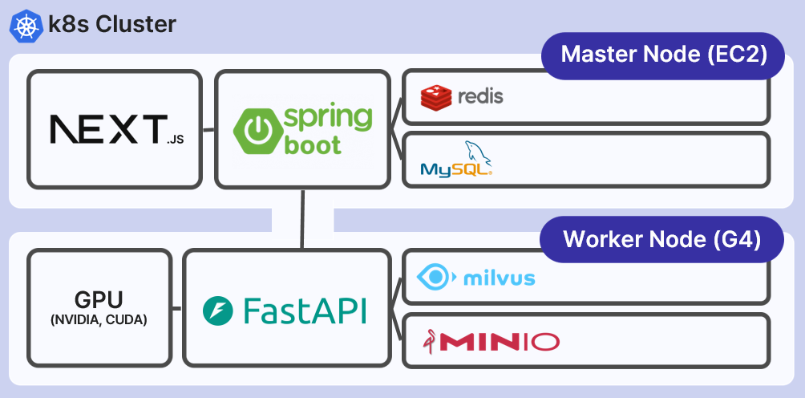

### ERD

  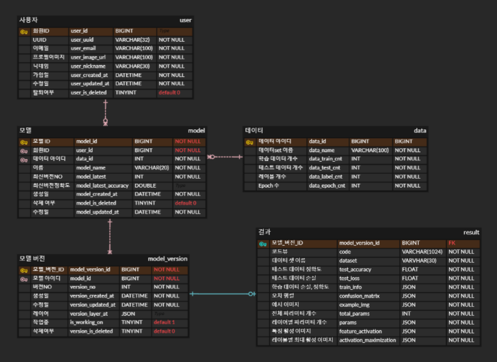

### Tech Stack

**Environment**

**Development**

**AI**

**INFRA**

**Communication**

## 서비스 기능

### 1. 랜딩페이지

  

-   `랜딩 페이지`에는 플랫폼에 대한 간단한 설명이 포함되어 있습니다.
  

  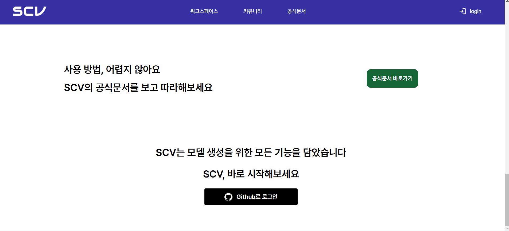

  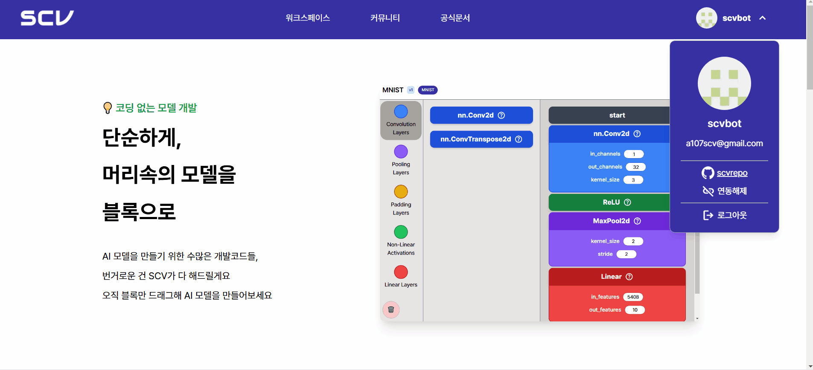

-   사용자는 `Github OAuth`를 통해 로그인/로그아웃 할 수 있습니다.
  

  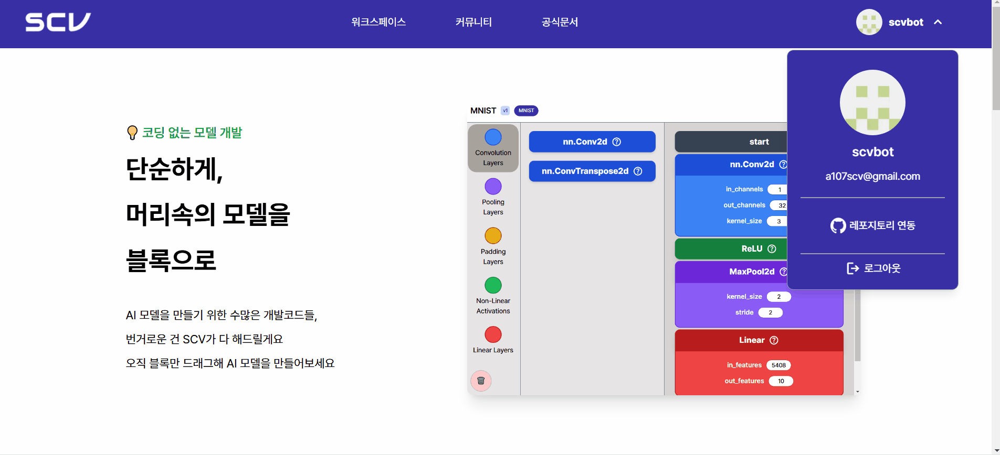

-   사용자는 `Github`의 새로운 레포지토리와 연동 또는 기존의 레포지토리와 연동할 수 있습니다. - 연동 이후 `연동해제`버튼을 통해 연동 해제 가능합니다.
      

### 2. 워크스페이스

  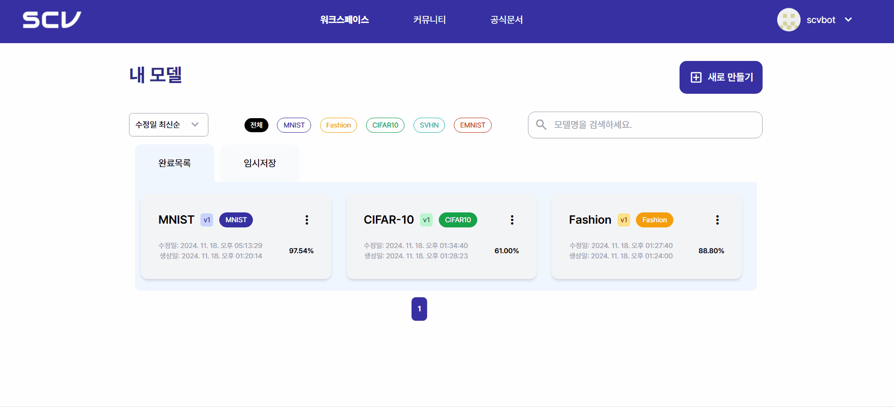

-   **검색 및 필터링 시스템** - 다양한 `필터링 옵션`을 제공하여 모델 조회가 가능합니다. - 데이터셋 (MNIST 외 4개) - 수정일/생성일 기준 정렬 - 모델명 검색 - 완료 / 임시저장 상태
  

  

-   **새로 만들기** - 모델 이름 설정과 데이터 지정 후 모델을 제작할 수 있습니다.
      

### 3. 블록코딩

  

-   **블록 코딩**: 드래그 앤 드롭으로 블록을 옮기고 파라미터들을 작성해 블록 코딩이 가능합니다. - **휴지통**: 블록을 삭제합니다. - **저장**: 저장 버튼을 통해 작업 중 저장이 가능합니다. - **실행**: - **실행 이전 저장**: 실행 전 자동 저장 기능을 제공합니다. - **유효성 검증**: 파라미터 값에 이상이 있을 시 실행 전 유효성 검사를 시행합니다. - **코드뷰 & 정확도**: 실행 이후 블록을 코드로 변환하여 보여줍니다.
  

  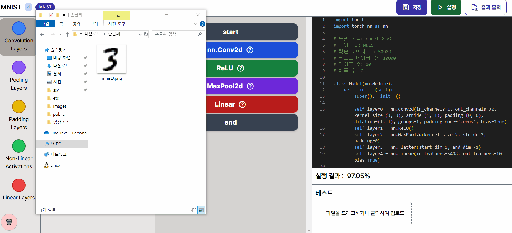

-   **테스트**: 사용자의 파일로 학습 결과를 테스트해볼 수 있습니다.
  

  

-   **결과 출력**: 모델에 대한 보고서를 작성하여 사용자에게 제공합니다.
      

### 4. 워크스페이스 - 상세

  

-   **깃허브 내보내기**: 연동된 사용자의 레포지토리로 `.py`파일로 코드를 내보냅니다.
  

  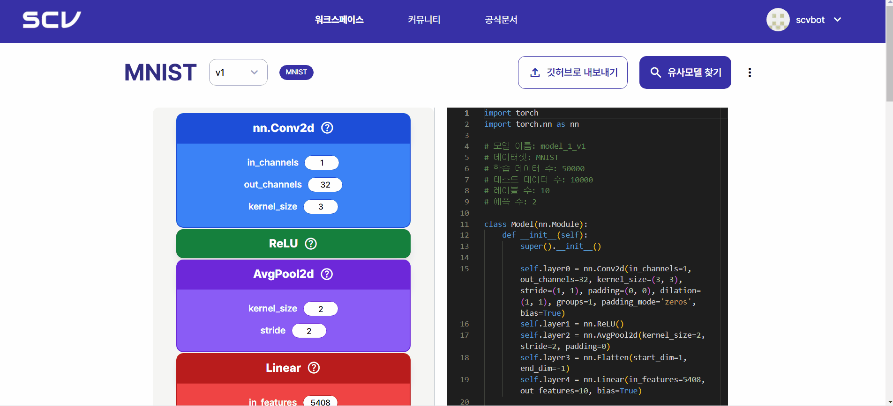

-   **유사모델 찾기**: 레이어를 선택하여 가장 유사한 모델을 검색하여 보여줍니다.
  

  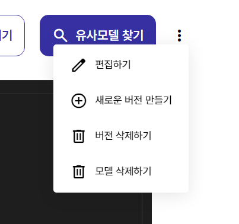

-   **편집하기**: 모델을 수정 가능합니다.
-   **새 버전 만들기**: 현재 버전을 토대로 새 버전을 제작합니다.
-   **버전 삭제하기**
-   **모델 삭제하기**
      

### 5. 커뮤니티

  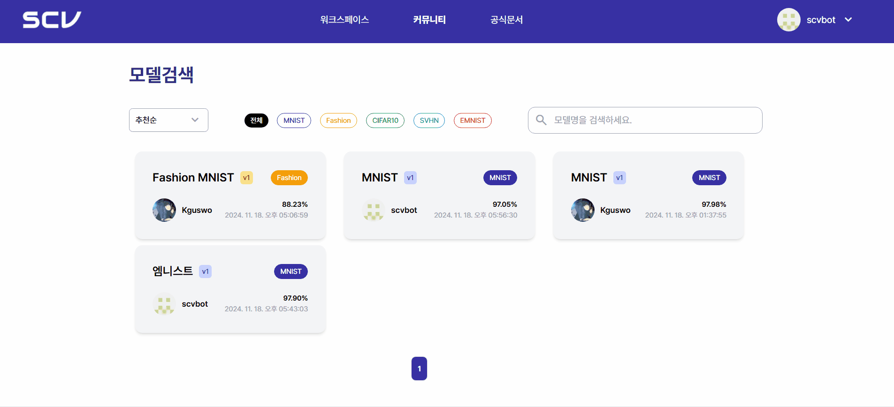

-   타인이 제작한 모델을 조회 가능합니다.
      

### 6. 공식 문서

  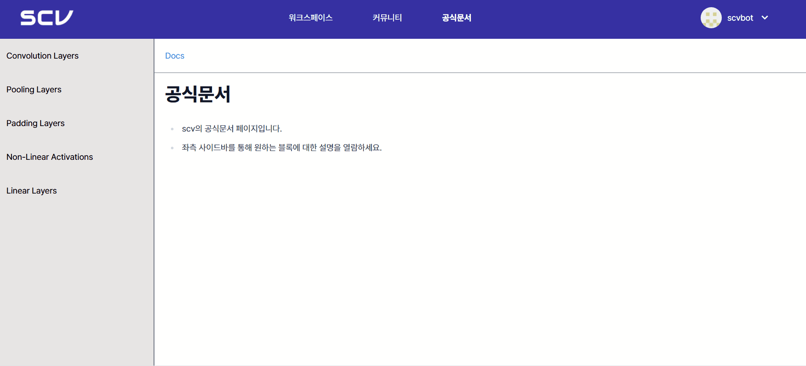

- 레이어 정보를 담은 공식 문서를 제공합니다.
  

## 후기

**현재**

> `

**서현**

> `

**민우**

> `

**예진**

> `

**동엽**

> `

**도형**

> `
